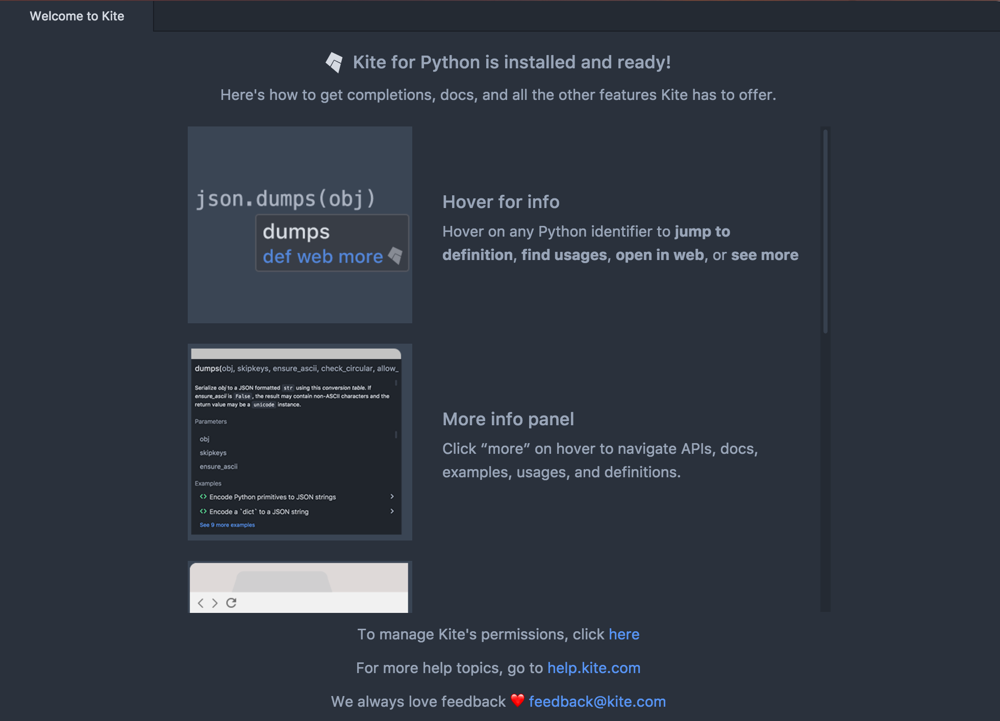

## Atom Kite Plugin Documentation

### Supported Atom Versions

All Atom versions greater than or equal to `v1.13.0` are supported.

### Supported Operating Systems

All OSes supported by Kite are also supported by the Atom Plugin, currently it supports:
- OSX (10.10 and higher)
- Windows (7 and higher)

### Supported languages

The plugin's features are only available in file types supported by the Kite engine:

- Python: All files with a `.py` extension are supported.

### Install

The Atom plugin is installed automatically by Kite if you have activated it for Atom.
It can still be installed manually either by searching for `kite` in the install package search input or by running `apm install kite` in your terminal.

### Startup

When starting Atom with Kite's plugin for the first time, the Kite's tour will be displayed in the active pane.

This tour will only be displayed once, if you want to see it again on next startup you can activate the `Show Kite Tour On Startup` setting.

### Status Bar

The Kite icon in the status bar displays the state of Kite for the current file.

TODO

### Editor Features

#### Hover documentation

When you move the mouse over a symbol, Kite can display some popup with a quick summary of what this symbol represent and links to additional documentation. 

#### Completions

Kite's Atom plugin exposes an `autocomplete-plus` provider. When in a supported file, you'll be able to see Kite's suggestions as well as some additional documentation and links in the `autocomplete-plus` panel.

#### Functions Signatures

When typing inside a function's parentheses the Kite plugin will display the function signature with information regarding the current argument and links to additional documentation.

#### Active Search

#### Context Menu

#### Commands
